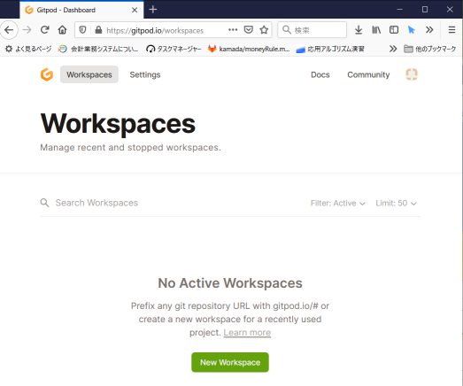

# アカウント準備 (Gitpod)

Gitpod を利用するには、Github もしくは Gitlab にログインする必要があります。どちらのアカウントを使ってもらっても構いませんし、普段使いのアカウントとは別に、演習用の新規アカウントを作成してもらっても構いません。

* [Github](https://github.com/): github のアカウントを作成する必要があります。
  * 手順にしたがってアカウントを作っておきましょう。
  * で、[Gitpod](https://www.gitpod.io/) にログインすることになりますが、初回は **サービス利用許諾** が必要かと思います。
* [Gitlab](https://about.gitlab.com/): gitlab 用の新規アカウントを作成するか、あるいは、google や twitter のアカウントで sign in 可能です。
* 事前に[gitlab](https://about.gitlab.com/)のページにいって、`Sign In` をクリックして一度サインインしてください。新規アカウント作成してもよいし、google, twitter などのアカウントで sign in しても構いません。一度利用許諾をしておく必要があります。
  * その状態で、[Gitpod](https://www.gitpod.io/)に Login しましょう。login の際は、gitlab を選択しますが、途中 **Gitpod からの Gitlab へのアクセス許可** および  **Gitpodのサービス利用許諾** をする必要があります。
  * 加えて、ページの右上のアイコンから、`Access Control` を開いて、GitHub に対する `read email addresses` への許可を与える必要があります（チェックを付ける）
  * 以上で初期設定は終わりです。

上記のアカウントが手配できていれば、以後は[Gitpod](https://www.gitpod.io/) に直接 login してアカウントを選ぶだけです。ログイン後、Workspace 一覧ページが見えるようになるかと。
最初、workspace を作っていない場合は、以下のような空っぽの状態でしょうけど。

プログラミング演習の workspace 作成方法に関しては[簡単な利用法](howto.md)をご覧ください。

