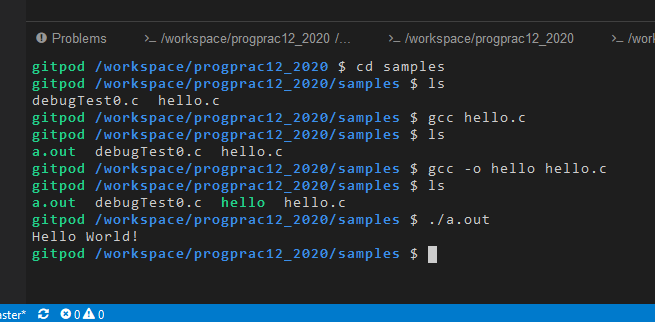

# コンパイル＆実行 (Gitpod)

ターミナルから、Unix コマンドを実行する方法と、GUI操作をおこなう場合を紹介します。

## Terminal 操作

もし、ターミナルがない場合は、先にメニューの `Terminal` から `New Terminal` でターミナルを開きましょう。

`gcc` というコンパイラが使えます。

以下は、`samples/hello.c` をコンパイルする例 (`注`: コンパイルする前に、ファイルを保存するのを忘れないように！）


```
gitpod /workspace/progprac12 $ cd samples (directory を変える change directory command)
gitpod /workspace/progprac12/samples $ ls  (現在の directory の内容を表示する list command)
debugTest0.c  hello.c
gitpod /workspace/progprac12/samples $ gcc hello.c  (hello.c をコンパイル)
gitpod /workspace/progprac12/samples $ ls (a.out という名前で実行ファイルが生成)
a.out  debugTest0.c  hello.c
gitpod /workspace/progprac12_2020/samples $ ./a.out (実行してみる)
Hello World!
```

各コマンドのオプションや、コマンドライン引数の与え方は、[こちら](https://sites.google.com/view/proenshu1kobeu/%E3%83%9B%E3%83%BC%E3%83%A0/%E7%AC%AC%E5%9B%9E_1/%E5%9F%BA%E6%9C%AC%E3%81%AEunix%E3%82%B3%E3%83%9E%E3%83%B3%E3%83%89)や[こちら](https://sites.google.com/view/proenshu1kobeu/%E3%83%9B%E3%83%BC%E3%83%A0/%E7%AC%AC%E5%9B%9E_4/c%E8%A8%80%E8%AA%9E%E3%82%BD%E3%83%BC%E3%82%B9%E3%83%97%E3%83%AD%E3%82%B0%E3%83%A9%E3%83%A0%E3%81%AE%E5%AE%9F%E8%A1%8C%E6%B5%81%E3%82%8C)を参考にしてください。
他にももっと知りたい人は検索してみてください。



## GUI 操作

以下は、IDE に VS code （2021年４月時点の標準）を選んだ場合の説明になります


1. explorer 画面を開いて、C のファイルを開いてください。左側に`>` マークがついているのはdirectory です。クリックで directory の中のファイルも見えるようになります。
   * `注`: ファイルを保存してない場合は、コンパイル前に保存しましょう！
2. コンパイル＆実行：実行対象プログラムを Editor 上で選択した状態で、`Run`->`Run Without Debugging` で実行＆コンパイルが可能です。
   * 初回は、設定のための選択肢が出てきます。`C++(gdb/lldb)`→`gcc build active task`をえらびましょう。同じ directory に `hello` ができれば成功。`.vscode` という directory の中に、`tasks.json` と `launch.json` が勝手にできます。
   * `注1`: 違うファイルを選択していると、コンパイルできません。
   * `注2`: 失敗したら、`.vscode` directory の中を空にして（`.vscode`は残す）、もう一度トライしてください。
   * `注3`: デバッガで止まっているみたいな場合は、開始ボタン（△）で実行するかと。

4. デバッグ: `run` の `Start With Debugging` だとデバッガ Sidebar が出てきて、そこで実行します。開始ボタン（△）で実行するかと。
   * 環境によっては ショートカット(debug: `F5`, 通常実行: `Ctl` + `F5`)が割り当てられています。
   * デバッガの使い方については、[こちら](../vsc/Cdebug.md)を見てください。


