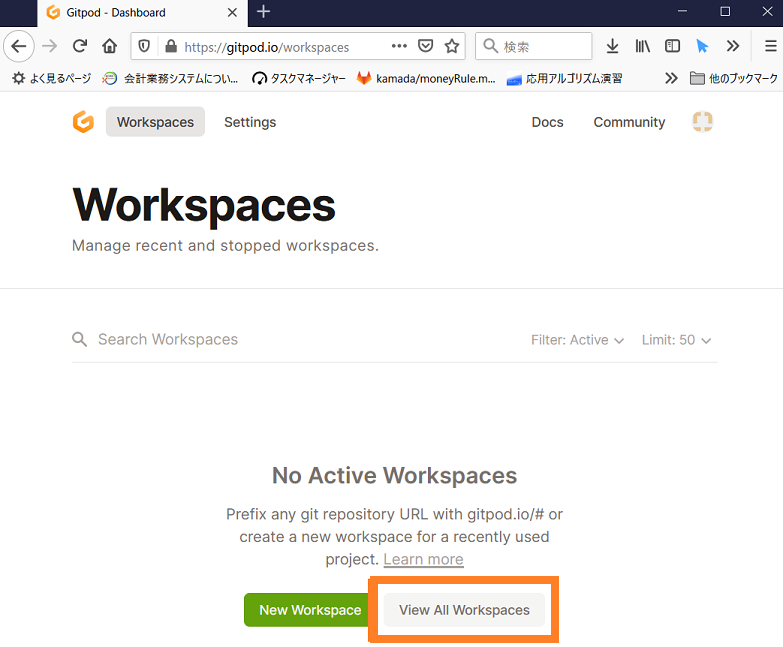
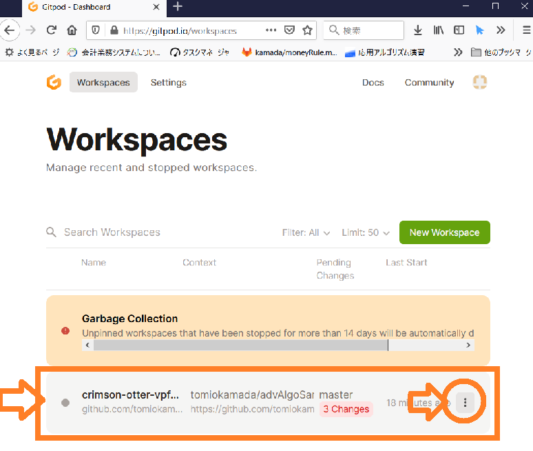
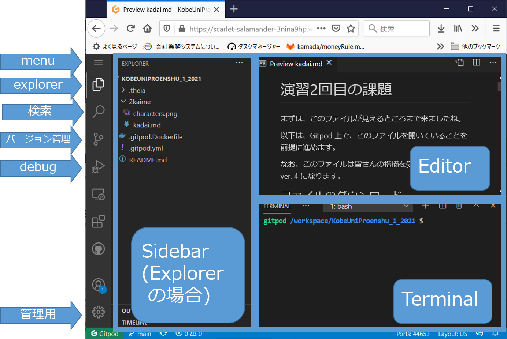
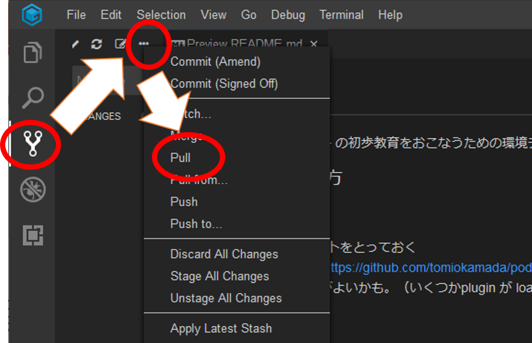
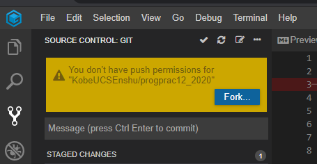

# 簡単な利用法 (Gitpod)

## Setup workspace (作成)

最初は github 上のレポジトリから皆さん用の Workspace を作成します。原則`初回に１度おこなうだけで十分`です。

* レポジトリの例：
  * 2024年プログラミング演習I 用レポジトリ([https://github.com/mzk-komatsu/KobeUniProenshu_1_2024](https://github.com/mzk-komatsu/KobeUniProenshu_1_2024))
  * 2020年プログラミング演習３用レポジトリ([https://github.com/KobeUCSEnshu/progprac3_2020](https://github.com/KobeUCSEnshu/progprac3_2020))
* github のページの URL 冒頭に`https://gitpod.io/#` をつけてアクセスします。
  * つまり、2024年プログラミング演習Iの場合 [https://gitpod.io/#https://github.com/mzk-komatsu/KobeUniProenshu_1_2024](https://gitpod.io/#https://github.com/mzk-komatsu/KobeUniProenshu_1_2024) をクリックするだけで OK です。
  * 各演習用 workspace setup links: [応用アルゴリズム演習](https://gitpod.io/#https://github.com/tomiokamada/advAlgoSamples)、[演習３](https://gitpod.io/#https://github.com/KobeUCSEnshu/progprac3_2020)
* セットアップには、少し時間がかかります。

上記で、workspaceが作成されます。原則、`初回だけで十分`です。しばらく同じ workspace を使いましょう。自分の作ったプログラムなども Workspace 上に作成されます。
別に、画面を閉じても workspace は消えません。
後に述べるように [gitpod](https://gitpod.io/) に login すれば、workspace 一覧が表示され、いつでも再開可能です。

`注`: Gitpod の無料ライセンスでは、`workspace は２週間アクセスしないと消滅します`。なくなってしまった場合は、しょうがないので、もう一度作成してもよいかと。

自分の作成した課題プログラムなどは、ダウンロードするなどして保存（後述）しておきましょう。
git 使いは、自分の private repository に保存するなりお好きにどうぞ。

## Start workspace (一覧・実行)

自分の workspace 一覧は、[Gitpod](https://gitpod.io/)にログインすれば、すぐ表示可能です。

あれ、ないですね。こちらでは現在動作中のworkspace 一覧が出ています。
ページを閉じたりしてしばらく触っていないと、停止するようです。

そんな場合は、オレンジの枠の `View All Workspace` を選択しましょう。

下の段の workspace を起動します。`・・・` から
`Open` もしくは `Start` ボタンで再開可能です。

`Pin` を選択すると、停止中でも workspace 一覧に掲載されるようになるので、チェックしておきましょう。

あと、`Share` を選択すると、他の人に自分の workspace を見せることができます。
gitpod 起動中の当該ページの URL を取得すれば OK です。
一方で、その URL をネットに晒すと、皆さんのアカウントと紐づけられた workspace 上で、いろんな悪いことがおこるかもしれませんので、注意しましょう。

## View: 開発画面

まず、画面右側について。

* Editor: ファイルの中身を表示したり編集したりする場所
* Terminal: 下側にはいろんなタブを選択できますが、今は`Terminal`が表示されています。こちらから、いろんな命令を実行できます。
* `注`: Editor やターミナルの画面は、実は`タブ`（各「小画面」の上側についているもの）を `drag & drop` (マウスを押した状態でカーソル移動し目的地でリリースする操作）することで、画面の上下を移動したり、画面を分割したりすることができます。文章で説明しづらいですが、マウス移動時に移動先が表示されるので、やってみればわかるかと。

次に画面左側ですが、左側のボタンで Sidebar の表示画面を切り替えできます。

* エクスプローラー: ファイルを選択するための画面
* 検索： 文字列を検索するための画面
* バージョン管理：バージョン管理, レポジトリアクセス
* デバッグ：デバッガを用いてプログラムの実行状態を確認するための画面

それと、皆さんが立ち上げた場合と見栄えが違うかもしれないです。
見栄えは、以下のような感じに変更可能です。

* menu bar を出したい：左上のメニューから`View`→`Appearance`→`Show Menu Bar`
* 背景色などテーマを変えたい：左上のメニューから`File`→`Preference`→`Color Thema` でお好きなものを選択

## Repository: 最新データの取得

レポジトリから最新情報を取得するには、以下の手順で `git pull` をおこないます。

1. `Source control` 用の Sidebar を表示し、
2. `...` をクリックして `Pull` を選択します。更新データがあればメッセージが表示されます。
3. `Explorer Sidebar` を表示すれば、新しいファイルなどが見えるようになっているはず。

## Cycle: 授業時のサイクル

1. [Gitpod](https://gitpod.io/)にアクセスし、workspace を開く
2. 新しい課題が出ている場合は、`git pull`でレポジトリ最新データの取得
   * 新しい課題が出ていれば、`2kaime` とか `kadai3` とか `mission4` とか、そういう directory (folder) が現れるかと。
3. 課題を解く
   * プログラムを記述
   * コンパイル＆実行
   * デバッグ
4. 課題提出
   * Gitpod からのファイルのダウンロード：`Explorer Sidebar` を開いて、ファイルを選択して右クリック、`Download` を選択すれば大丈夫。
   * Gitpod へのアップロード：こちらは、ファイルの drag&drop で大丈夫。

## Operations: 簡単な操作

* ファイル生成
  * 上部のメニューから`File`から`New File`を選んでも OK
  * 指定 directory (folder) に生成したいなら、対応 directory (folder) で 右クリックで `New File` を選んでファイル名を指定しておしまい

* ファイルの保存（クラウド上の Workspace に存在）
  * 画面上側のFileメニューからSave を選ぶ
  * 上記操作の際、メニュー右側にショートカットキーが表示されていたかと。例えば、`Control` キーを押しながら `S` キー（もしかしたら環境によって違うキーが割り当てられている可能性があります）を押すだけでもファイルが保存できるかと。（Mac の場合、`Command` キーを押しながら `S` キーとか）

* ファイルのダウンロード
  * 左の Sidebar から対象ファイルを選んで、右クリック、ポップアップメニューから`Download` でOK

* タブの選択・移動
  * 画面右側でいろんなファイルを見ている際は、複数のファイルをタブ（画面上側にでているでっぱり部分）で切り替えられます。
  * `タブ`を `drag & drop` (マウスを押した状態でカーソル移動し目的地でリリースする操作）することで、画面の上下を移動したり、画面を分割したりすることができます。マウス移動時に移動先が表示されるので、やってみればわかるかと。

* その他操作は、需要に応じて、[FAQ](howto.md#FAQ)に記載予定

## Compile ＆実行

[compile](compile.md)を見てください

<!-- ## Debug

デバッグの方法については、[こちら](gitpod_Cdebug.md)を見てください。 -->

## FAQ

* Q: 画面、へんなことなっちゃった。もどしてくれー
  * 画面左側のパネル(Sidebar) は、一番左端のボタンで表示切替できるよ。
  * 右側も含めて変なことなったら、menu の `View` から、必要なものを選んで表示させてください。
    * 今後は、消さずにタブを切り替えたりしながら使おう！

* Q: `You don't have push permissions for ...` という警告メッセージとともに、`Fork` ボタンが現れる。
  * メッセージは、「対象レポジトリに書き込み権限ないよ。」というものです。皆さんが作成したプログラムを、「対象レポジトリ」に書き込めないけどいいの？っていうアラートです。
  * `Fork` は、「皆さんの作成したプログラムを置くためのレポジトリを作成しない？」っていう提案です。
  * なので、「対象レポジトリから pull するだけ」なら、上記警告は無視していて問題ありません。

* Q: gitPod が起動しなくなりました。
  * browser に記憶された状態が、なんらかの原因で「変」になると、うまく起動しないようです。
  * 普段使っている browser と違うものを使ってみましょう。Chrome, Microsoft Edge, Firefox あたりは使えるので、違うものを使ってみましょう。
    * 新規インストールが必要な場合は、[Chrome](https://www.google.com/intl/ja_jp/chrome/), [Firefox](https://www.mozilla.org/ja/firefox/new/) からどうぞ。
  * あるいは、各 browser のシークレットウィンドウやプライベートウィンドウを使うことでも解決するんじゃないかと思います。（ただ、Edge ではダメだったそうです。他のブラウザ
  でもダメだった場合は、鎌田まで連絡ください。）
  * 多分、browser のキャッシュをクリアしてもいいんでしょうが、色々情報持っていることも多いので、まずは上記で確認しましょう。

* Q: ファイルやフォルダの作成ができなくなりました。  
  * 上記の「gitPodがきどうしなくなりました」の対処をしてみましょう。
  * あるいは、ターミナル上で `mkdir` や `cp` コマンドが使えるなら、以下の対処法で解決可能かと。
    * ターミナル上で、`mkdir` コマンドや `cp` コマンドでファイルやフォルダを作ってください。あとは、Explorer 経由で操作・編集可能かと。コピー操作は、Explorer 画面上の右クリック操作で、Duplicate してから Rename するのでもよいかと。
  
