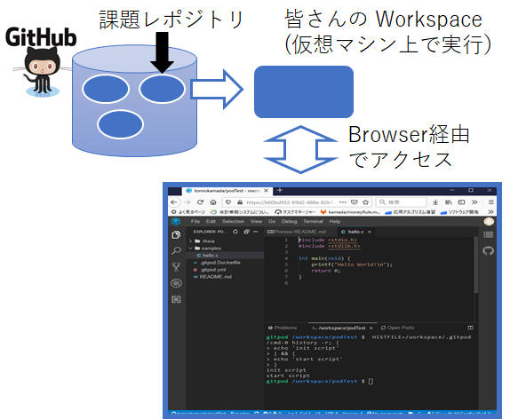

# Gitpod の簡単な紹介

クラウド上の仮想マシン上にプログラム開発環境を作成し、
Browser 上の統合開発環境から操作できるようになっています。

* git: 主にプログラム開発に用いられるバージョン管理システム
* github: ソフトウェア開発プラットフォーム。git を利用。
* gitpod: github 上のプログラムを仮想マシン上で即座に動作・開発できる環境
* VS codeあるいはEclipse Theia: Browser 上で動作している開発環境。操作はほぼ同じ。2021年頃からVS code が標準に変更された模様。
<!---
[2020年度のプログラミング演習１・２](https://sites.google.com/view/proenshu1kobeu/)では、ベースになるプログラムやデータを課題レポジトリ(@github)に配置し、
皆さんが自宅プログラミング環境を整えなくても、
gitpod 上でプログラミング演習（Unix command, File I/O 操作含む）ができるようにする予定です。
-->
[2023年度のプログラミング演習I](https://sites.google.com/view/csprog2023/)では、ベースになるプログラムやデータを課題レポジトリ(@github)に配置し、
皆さんが自宅プログラミング環境を整えなくても、
gitpod 上でプログラミング演習（Unix command, File I/O 操作含む）ができるようにする予定です。
