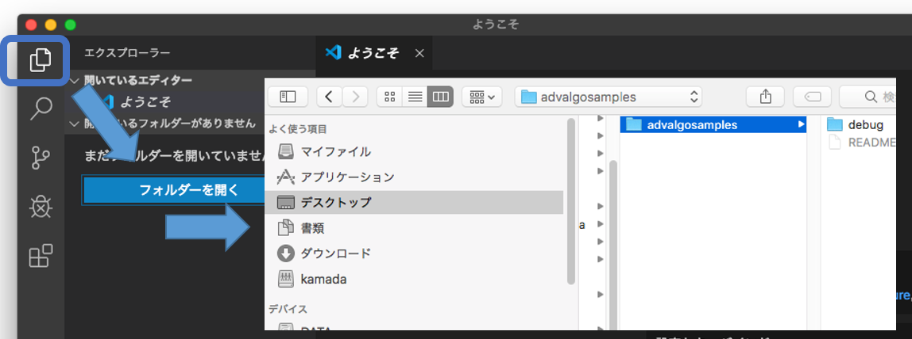

# VS Code, C環境の使い方

## Setup: 起動の前に

先に事前準備しましょう([演習室用](eroom.md), [自宅環境](Csetup.md))。

終わったら、VS code を起動しましょう。
演習室では、Finder をあげて`アプリケーション`の中にある `Visual Studio Code` をダブルクリックすればOKです。

## Start: 起動

以下が、普段つかう画面です。左側のアイコンの機能を把握しておいてください。

* エクスプローラー
* 検索
* ソース管理
* デバッグ
* Extension

クリックすると、各機能用の画面がOn/Offされます。

## Workspace Folder: フォルダを開く

プログラムを配置するフォルダの指定を要求されます。
自分でフォルダを選択して選んでください。

## Create Files: プログラム作成

新規プログラム作成時は、フォルダの`新しいファイル`ボタンを押して、hello.c とかファイル名を入力してください。
insider build 使うとか聞かれるかもしれませんが、拒否してもらってOKです。

drag & drop で配置してもらうのでも構いません。

## Execution: プログラムの実行

1. explorer 画面を開いて、C のファイルを開いてください。左側に`>` マークがついているのはdirectory です。クリックで directory の中のファイルも見えるようになります。
   * `注`: ファイルを保存してない場合は、コンパイル前に保存しましょう！
2. コンパイル＆実行：実行対象プログラムを Editor 上で選択した状態で、`Run`->`Run Without Debugging` で実行＆コンパイルが可能です。
   * 初回は、設定のための選択肢が出てきます。`C++(gdb/lldb)`→`gcc build active task`をえらびましょう。同じ directory に `hello` ができれば成功。`.vscode` という directory の中に、`tasks.json` と `launch.json` が勝手にできます。
   * `注1`: 違うファイルを選択していると、コンパイルできません。
   * `注2`: 失敗したら、`.vscode` directory の中を空にして（`.vscode`は残す）、もう一度トライしてください。
   * `注3`: デバッガで止まっているみたいな場合は、開始ボタン（△）で実行するかと。

4. デバッグ: `run` の `Start With Debugging` だとデバッガ Sidebar が出てきて、そこで実行します。開始ボタン（△）で実行するかと。
   * 環境によっては ショートカット(debug: `F5`, 通常実行: `Ctl` + `F5`)が割り当てられています。
   * デバッガの使い方については、[こちら](../vsc/Cdebug.md)を見てください。

標準出力は、ターミナルもしくはデバッグコンソールにでます。

### Arguments: プログラムへの引数の与え方

`launch.json` をイジったり、`Runner`を設定する方法もありますが、いろいろ面倒なのでターミナルから実行する方法を教えます。

「ターミナル」→「新しいターミナル」で、vscode 内にターミナルが開くので、そこでコマンドを実行するのが早いでしょう。

## Input Files: 入力ファイルの準備

プログラムは、対象の「フォルダ」直下で実行されます。

なので、アクセスファイルは、「フォルダ直下」に置くか、ファイル名を指定する際、対象ファイルへの正しい（相対／絶対）パスを記述しましょう。

## FAQ, トラブルシューティング

* Q: Dock に Visual Studio Code がない
  * Ans: 「Finder」の左部の「アプリケーション」の中を探してください。登録したければ、Dock 上で右クリックした際にあらわれるオプションメニューで選べます。

