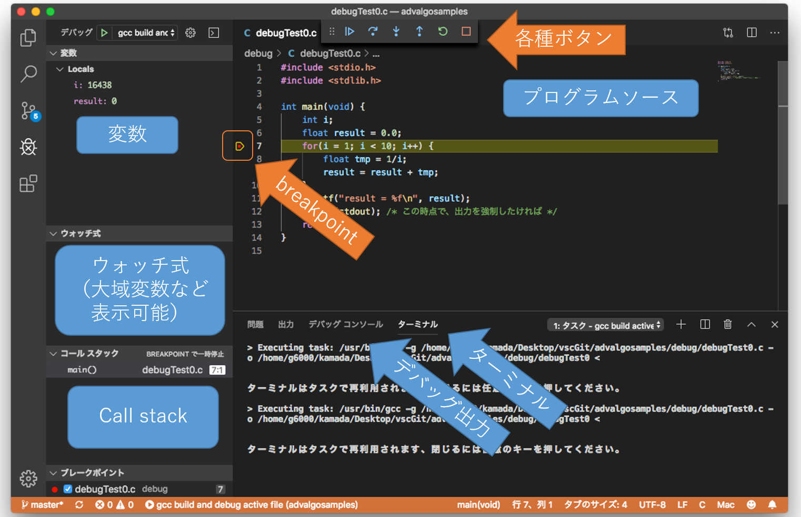

# デバッグ編 (VScode, C言語)

## Target: はじめに

まずは、なにかプログラムを持ってきましょう。

以下で用いる例は、[debugTest0.c](https://github.com/KobeUCSEnshu/progprac12_2020/blob/master/samples/debugTest0.c)です。

-   1/1 + 1/2 + ... + 1/9

を計算する**つもり**（そうはなっていない）のプログラムです。

```cpp
#include <stdio.h>
#include <stdlib.h>

int main(void) {
    int i;
    float result = 0.0;
    for(i = 1; i < 10; i++) {
        float tmp = 1/i;
        result = result + tmp;
    }
    printf("result = %f\n", result);
    fflush(stdout); /* この時点で、出力を強制したければ */
    return 0;
}
```

動作させると、なぜか、

    result = 1.000000

という結果になってしまいます。なぜでしょう？

ってことで、よく分からないものは、デバッガにかけて調べましょう。
(一瞬で答えが分かったという人も、今後に備えて、デバッガの使い方を学びましょう)

Start: デバッガ起動
------------

デバッグ実行の際は、メニューの「デバッグ」→「デバッグの開始」でOKです。

デバッグ用画面になります。



この画面は、７行目にブレークポイントを入れて、そこで停止したところです。

画面が以下のように分かれています。

-  変数（Variables） を表示する画面
-  watch expression: 指定した式を表示可能。大域変数も表示したければこちらで対応可能
-  Call Stack: 実行中の関数呼び出し状況（呼び出しスタック）表示＆選択用(今回は、main のみ)
-  プログラムソース
-   コンソール（実行出力などが表示される, Mac ではデバッグコンソールに表示されるみたい）

## Breakpoints: ブレイクポイント設定

ブレイクポイントは、プログラムに止まってほしい場所のことです。

* まずは main で止まって欲しいとか、
* 7 行目に来たときは毎回止まってほしい（上の図の例）

なんてときに使います。

-   ブレイクポイントの設定には、ソース画面左端（数字の左側の端っこ）のところをクリックします。赤いマーカーがついたり消えたりするはずです。


## Step: １行実行

プログラムを一行進めてみましょう。「デバッグ」ウィンドウの、「ステップオーバー」というボタンを押してください。

今止まっているのは、

-   7 行目に入ったところ（次に、７行目を実行するところ）

です。ステップ実行で、一行実行させると、

-   7行目が終わって、8行目に進み
-   変数 i が設定／更新されます。

ループを何度か回ると、変数 `tmp` の値が、「あれれ？」って感じになるはずです。

補足：

-   一行実行の際、関数の中まで実行を追いかけたい場合は、ステップインを選択しましょう。
-   逆に、関数から呼び出し側に抜けたい場合は、ステップオーバーを選択しましょう。


## Resume: プログラム再開

プログラムを再開（一行単位でなく、次のブレイクポイントなり終了まで実行）させたいときは、

「続行」アイコンを押しましょう。

ちなみに、11行めのprintf()
を実行し終わっても、コンソールに文字出力がでないことがあります。

これは、書き込んだ文字がバッファにたまったママになっているからで、12行目の様に

fflush(stdout);

とかしてやると、きちんと出力されます。

補足：

-   デバッグを終了したい場合は、「終了」ボタンでプログラムを終了しましょう。

## Call Stack: 関数スタック

[こちら](http://www.fine.cs.kobe-u.ac.jp/members/kamada/algo/#!basic.md) を読んで、なんなら課題を解いてみてください。


Tips
----

### Global Variables: 大域変数の表示

局所変数と違い、大域変数一覧は、表示されません。

でも、代わりに「ウォッチ式」にて、指定した式の内容を表示できますので、そちらを使いましょう。
`+`ボタンを押せば式を追加できるはず。


